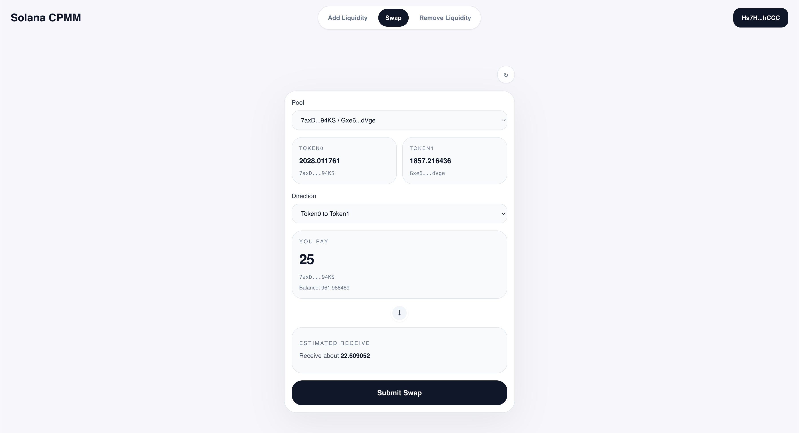

<h1 align="center">Solana CPMM Frontend</h1>

<p align="center">
  <a href="https://github.com/hieutrinh02/solana-cpmm-fe/blob/main/LICENSE">
    
  </a>
  
  
  
</p>

<p align="center">
  
</p>

## ✨ Overview

This repository contains a Next.js frontend for interacting with the [`solana-cpmm-program`](https://github.com/hieutrinh02/solana-cpmm-program). It is intended to be used together with the indexer at [`solana-cpmm-indexer`](https://github.com/hieutrinh02/solana-cpmm-indexer).

Its scope is intentionally narrow:

- read pool data through the local `solana-cpmm-indexer`
- connect to an injected Solana wallet
- support three user actions:
  - add liquidity
  - swap
  - remove liquidity

## 📄 High-level Design

The frontend follows a simple split:

1. Read pool data from the local indexer
2. Derive the required PDAs and token accounts in the browser
3. Build Solana transactions directly against the deployed CPMM program
4. Ask the connected wallet to sign and submit
5. Refresh data after successful transactions

Pages:

- `/add-liquidity`
- `/swap`
- `/remove-liquidity`

## 🛠 Run Locally

From within the frontend folder:

Install dependencies:

```bash
npm install
```

Copy `.env.example` to `.env` and configure:

```env
INDEXER_URL=http://127.0.0.1:8787
NEXT_PUBLIC_RPC_URL=https://api.devnet.solana.com
NEXT_PUBLIC_PROGRAM_ID=9diuYeEwSQWhagiV4nMDEPhm2fkheSnjqDPYwRZTSdsq
NEXT_PUBLIC_PROGRAM_ADMIN_AUTHORITY=BNToqmqXLNvUrEGGS7io3MQodB9dT56M4Q1Q8xcPYyk7
```

Run in development mode:

```bash
npm run dev
```

The app expects the local indexer to already be running.

## ⚠️ Disclaimer

This code is for educational purposes only, has not been audited, and is provided without any warranties or guarantees.

## 📜 License

This project is licensed under the MIT License.
